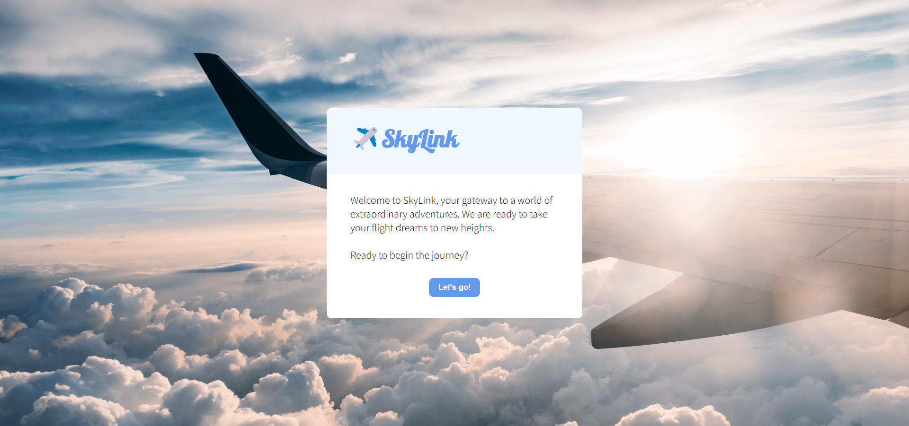
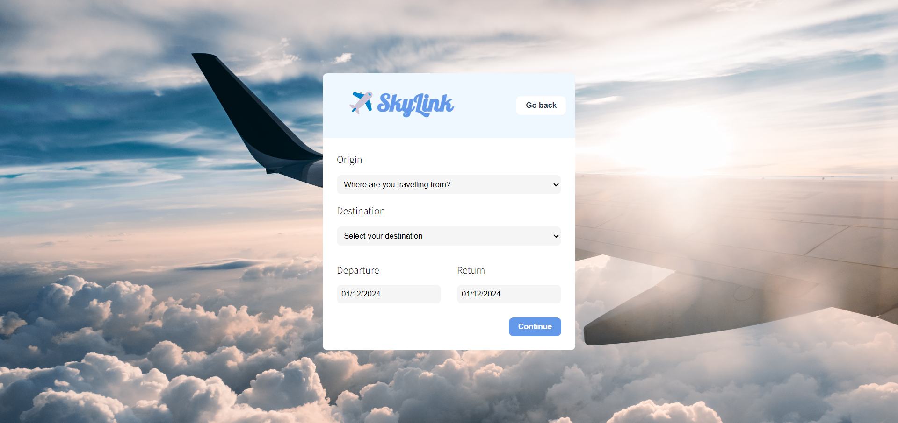
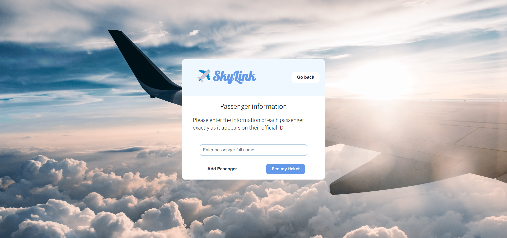
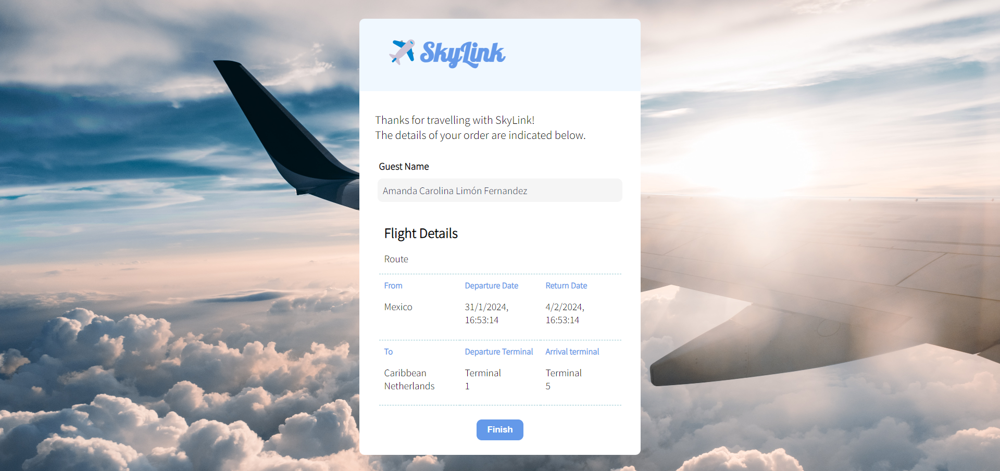

# SkyLink - Flight Booking Page

SkyLink is a flight booking page developed as a practice project to learn and apply key concepts of state machines in React, using the Xstate v5 library.

## Features

- **Welcome:** Initial view with a welcome message and a button to start the flight search.
- **Search:** Select the origin and destination country through an API, along with departure and return dates.
- **Passengers:** Capture of data for each passenger to customize the reservation.
- **Tickets:** Display detailed reservation information, consolidating all entered data.

## Technologies Used

- React
- Xstate v5
- CSS

## Usage Instructions

1. Clone the repository: `git clone https://github.com/your-username/skylink.git`
2. Install dependencies: `npm install`
3. Start the application: `npm start`

## Demo

[https://amandalimon.github.io/skylink-react-xstate-practice/](#)

## Screenshots

## Contributions

Contributions are welcome! If you find any issues or have suggestions to improve the project, please create an issue or submit a pull request.

## License

This project is licensed under the MIT License - see the [LICENSE.md](LICENSE.md) file for details.
